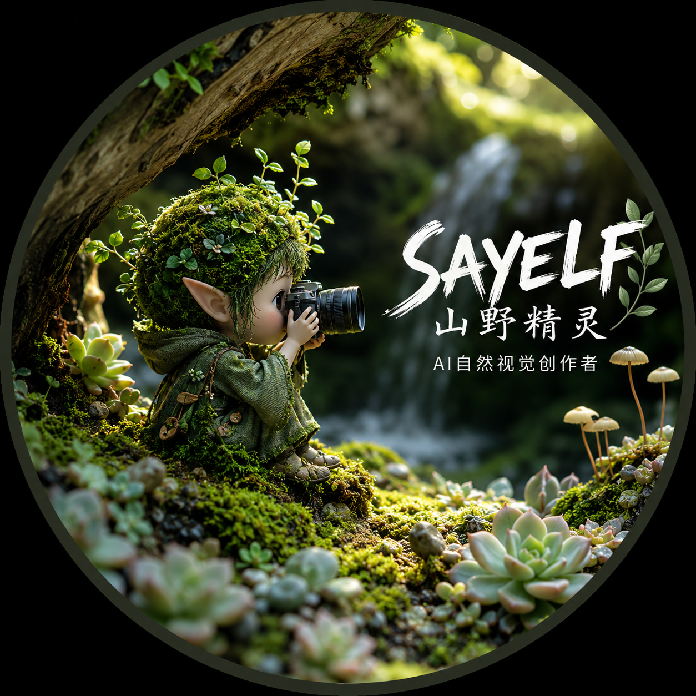

# sayelf-birdpick · 识别/评价工作流代码

<p align="center">
  
</p>

对应架构文档《sayelf-birdpick-架构文档.md》第1-3节。这一版实现了识别工作流(Python)、
评价工作流(Node)的核心逻辑，并提供独立的本地试用 WebUI、首发用户规则与训练数据贡献入口；云端(语义标注/AI复核)
尚未接入，真实支付、账号计时和桌面壳仍未实现。商业模式与数据闭环见 [BUSINESS_MODEL.md](BUSINESS_MODEL.md)。

## 许可证与第三方组件

本仓库的许可证按组件划分，不能将下列内容视为同一套 MIT 授权：

### 本仓库自有代码：MIT License

除下述第三方组件外，本仓库由 sayelf 编写的原创代码、脚本、配置和文档采用 MIT License，详见 [LICENSE](LICENSE)。

### RF-DETR 相关部分：Apache License 2.0

本项目通过 `requirements.txt` 使用 RF-DETR 的 `rfdetr` Python 包。RF-DETR 上游开源包及其标注为 Apache 的相关组件遵循 Apache License 2.0；该许可证边界不因本仓库的 MIT 声明而改变。归属声明和许可证链接见 [NOTICE](NOTICE)。RF-DETR 的 Plus 组件或其他未在本项目中分发的组件可能适用不同条款，请以其上游声明为准。

### 模型权重不包含在本仓库内

本仓库不包含 COCO 预训练权重、鸟类/眼部微调权重或其他模型权重文件。运行时可能由 RF-DETR 从其上游来源下载/缓存默认权重，也可以通过 `SAYELF_BIRD_DETECTION_MODEL_PATH` 和 `SAYELF_BIRD_EYE_MODEL_PATH` 指向用户自行获取的本地权重。模型权重需要另行获取或下载，并由使用者自行确认和遵守对应的许可证、来源及使用条款；本仓库的 MIT License 不覆盖这些权重。

## 目录

```
sayelf-birdpick/
├── index.html                 # 独立的本地试用 WebUI（三类筛选与额度演示）
├── local_server.py            # 仅监听127.0.0.1的本地 WebUI/API 服务
├── BUSINESS_MODEL.md          # 冷启动、宣传、数据闭环与护城河方案
├── assets/
│   └── sayelf-logo.png        # SAYELF logo
├── requirements.txt          # Python依赖
├── package.json              # Node依赖
├── data/
│   └── schema.sql            # SQLite建表脚本
└── src/
    ├── recognition/           # 识别工作流(Python)
    │   ├── quality.py         # 清晰度/曝光
    │   ├── dedup.py           # 连拍去重
    │   ├── detect.py          # RF-DETR主体检测+眼部关键点
    │   ├── eye_focus.py       # 眼部合焦比例（核心价值层）
    │   └── pipeline.py        # 主流程编排，写入SQLite
    └── evaluation/             # 评价工作流(Node)
        ├── scorer.mjs          # 加权求和引擎
        ├── score-demo.mjs      # 命令行验证脚本
        └── templates/          # 三套冷启动种子模板
```

## 安装

```bash
# Python 侧（识别工作流）
pip install -r requirements.txt

# Node 侧（评价工作流）
npm install
```

## 打开最小 WebUI

在仓库目录运行下面的本地服务后访问 `http://127.0.0.1:8765/index.html`。它同时提供静态 WebUI 和本机识别 API；服务只绑定 `127.0.0.1`，不提供云端接口。

```bash
python local_server.py
```

这个独立页面是本地试用产品：冷启动规则为首批 100 名激活用户 30 天内免费体验、最多本地处理 1,000 张；演示页当前默认提供 50 张本地演示额度，之后按以下本地额度购买：50 张加量包 9.9 元、100 张 19.9 元、1000 张 99 元、10000 张 490 元。以上套餐全部使用本地电脑处理，支持在本次会话分批导入，并按“保留 / 待定 / 排除”三类进行人工筛选。正式版建议把免费额度改为按月发放、把付费额度按账号累计；名额与计时需要正式账号服务端，当前 HTML 只展示规则。

点击“运行本地 AI 识别”后，浏览器会把当前照片通过本机 `127.0.0.1` 发送给 `local_server.py`，复用 `src/recognition/` 中的 RF-DETR 主体检测、清晰度、曝光和可选眼部模型；结果只回传当前页面，不上传云端。若只打开静态 HTML 而没有启动 `local_server.py`，仍可使用本地预览、人工筛选和导出标记，但 AI 按钮会提示服务未启动。

如果需要调用 API 云上模型，需单独设置“月费上限”和“调用上限”；实际接入时必须同时满足两项额度，超过任一上限就停止云端调用，也可以随时关闭云端控制。当前页面不接入支付或云端 API；本地 AI 识别也不会在浏览器内直接运行 RF-DETR。

页面还提供“训练数据贡献（可选）”入口。授权说明明确列出用途、数据范围、保存期限、撤回方式、训练后不可逆影响和接收方；用户必须明确勾选训练用途和照片处理权确认后，才能生成本地训练候选清单。清单不含图片二进制、EXIF、GPS 或本地路径，不会自动上传。当前三类筛选是候选信号，不等于训练真值，正式训练前仍需隐私处理、人工复核、数据集版本和模型评估。贡献与否不影响本地使用或购买。

贡献积分采用试验规则：授权本身不计分，经过复核的有效样本 1 张计 1 分；被邀请用户完成首次筛选并导出结果，计 20 分（每月最多 5 人）；100 分可抵扣 100 张本地额度。积分不可提现、不折现，当前独立 HTML 只展示规则，不计分。

## 冷启动商业模式与数据闭环

商业模式、宣传试验、训练数据如何取得与回馈、护城河、指标和 90 天实施顺序，见 [BUSINESS_MODEL.md](BUSINESS_MODEL.md)。核心原则是“先让用户本地获得价值，再以可选、可追溯、可撤回的授权获得真实训练候选数据”，而不是把用户不知情的照片默认为训练数据。

## 跑通识别工作流

```bash
# 把测试照片放进一个文件夹，比如 D:\test-photos
python -m src.recognition.pipeline D:\test-photos data\photos.db
```

跑完之后 `data/photos.db` 里的 `photos` 表会有每张照片的清晰度、曝光、主体检测框、
眼部合焦比例、连拍分组、三段式分级(`tech_grade`)。图像读取和推理在本机完成；如果本机
尚未缓存默认权重，RF-DETR 首次初始化可能从上游获取权重，但不会上传照片。微调后的
检测/关键点模型权重训练好之前，会自动退回 RF-DETR 的 COCO 预训练权重——能跑通，
但检出率和眼部定位精度会明显低于微调后的效果，这是预期之内的，不是bug。

## 跑通评价工作流

```bash
node src/evaluation/score-demo.mjs data/photos.db national-geographic
```

会打印按"国家地理风"模板打分排序后的前20张照片路径和分数。换成 `tangshui` 或
`ecological-record` 可以看同一批照片在不同审美模板下排序会怎么变。

## 现在能跑通、但还没到生产可用的地方

- **检测/关键点模型还没微调**：用的是COCO通用权重，鸟类检出精度和眼部定位精度有限，
  按上次讨论的顺序，需要先用CVAT标一批群友照片(100-200张)微调后替换
- **三段式分级阈值是冷启动默认值**（`pipeline.py` 里的 `SHARPNESS_PASS` 等几个常量），
  没有用真实标注数据校准过，先能跑通验证代码逻辑，不代表这几个数字是准的
- **语义标签(semantic_tags)目前是空的**：评价工作流的 `tagBonus` 部分暂时不会加分，
  因为语义标注(云端多模态大模型调用)这部分代码还没写
- **没有桌面壳界面**：当前提供独立的 `index.html` + `local_server.py` 本地 WebUI，
  仍需在命令行启动服务；独立的 `review.html` 尚未实现
